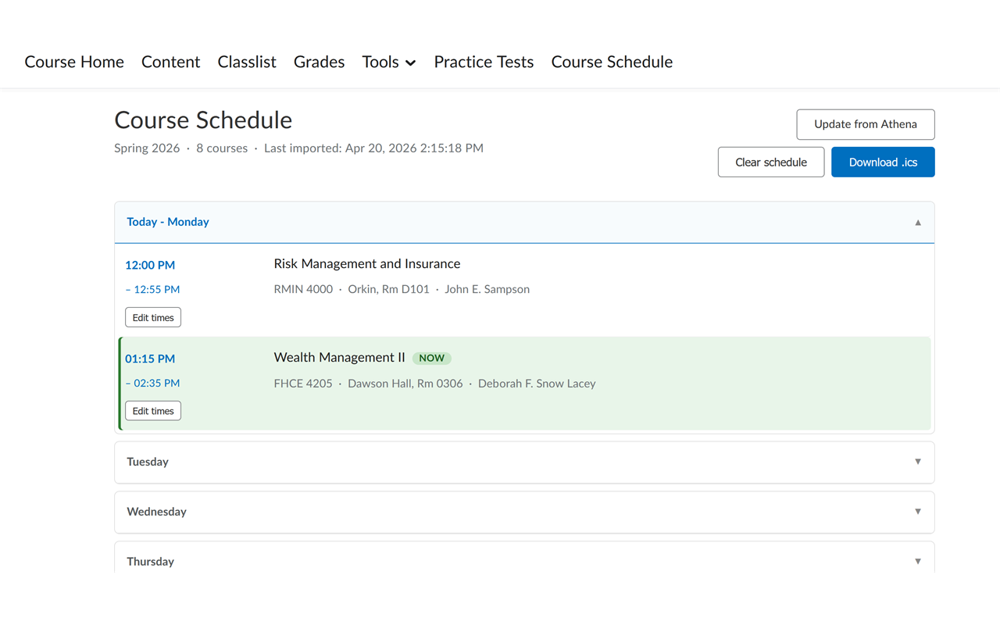
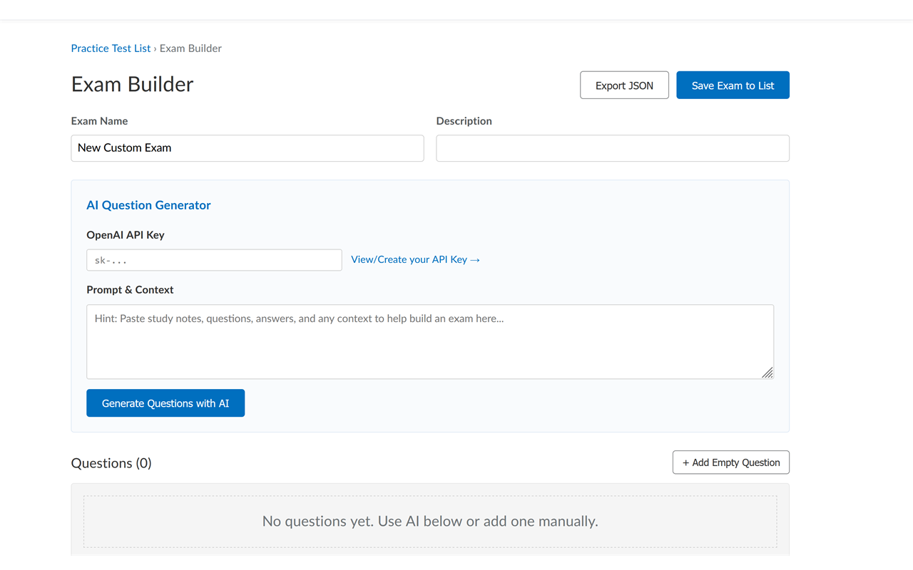
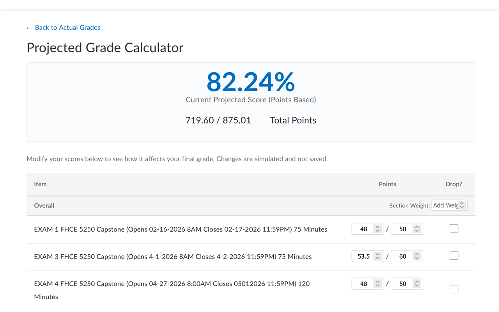

# ELC Essentials

ELC Essentials is an open-source browser extension for students who use the University of Georgia D2L Brightspace site (`uga.view.usg.edu`). It adds practice quizzes, a course schedule view, a task dashboard, and a projected grade calculator on top of the pages you already use for class. The extension also reads your class schedule from UGA Athena when you choose to import it.

This project is independent. It is not affiliated with D2L, the University System of Georgia, or the University of Georgia. Use official course and grade information when a decision matters.

**License:** [MIT](LICENSE). You may use, modify, and distribute this code for any purpose, including commercial use, as long as you include the license notice.

**Maintainer:** [@exearthur](https://github.com/exearthur) (Arthur Pacheco)

## Screenshots

These images show three core features on UGA D2L Brightspace. The same files live in [`store-screenshots/`](store-screenshots/) for Chrome Web Store and Firefox Add-ons listings.

### Course Schedule

Imported from Athena, grouped by day, with a live **NOW** badge on the class in session. You can edit times, re-import, or download a `.ics` calendar file.



### Exam Builder (Practice Tests)

Create custom practice exams by hand or paste study notes and generate multiple-choice questions with your own OpenAI API key.



### Projected Grade Calculator

On the D2L Grades page, simulate new scores, drop assignments, or max out grades to see a projected percentage. Changes stay local and are never saved to Brightspace.



---

## What this extension does

The extension runs on UGA D2L Brightspace and on the Athena registration site. When enabled, it injects new navigation tabs into D2L and adds tools on existing pages. The sections below list every major feature and what each one does.

### Toolbar popup (enable / disable)

Click the extension icon in your browser toolbar to open a small popup. You can turn the extension on or off for D2L and Athena without uninstalling it. After you change the setting, reload the open D2L or Athena tab so the page picks up the new state.

### Practice Tests

A **Practice Tests** tab appears in the D2L top navigation. This feature is a full practice-quiz system stored in your browser.

| Capability | What it does |
|------------|--------------|
| **Exam list** | Shows all loaded practice exams with best score and attempt count. |
| **Create an exam** | Opens the Exam Builder so you can write questions by hand. |
| **Import exams (JSON)** | Loads one or more exams from a `.json` file. Duplicate exam IDs are skipped with a warning. |
| **Import from URL** | If you set `EXAM_DATA_URL` at the top of `content.js` to a raw HTTPS JSON URL, exams load automatically on page load (then cache locally). |
| **Export** | Download all exams or a single exam as JSON for sharing or backup. |
| **Edit / delete** | Change an existing exam or remove it from the list. |
| **AI question generator** (optional) | In Exam Builder, paste study notes and an OpenAI API key. The extension calls the OpenAI API (through the background script) and appends generated multiple-choice questions. Your key is stored locally in browser storage. |
| **Question banks** | Each exam can define `questionsPerAttempt` so each attempt draws a random subset from a larger bank. |
| **Display modes** | **All questions on one page** (scroll) or **one question at a time** (Next / Previous). Your choice is remembered per exam. |
| **During the quiz** | Sidebar shows question numbers and whether each item is answered. **Check Answer** grades one question and can show an explanation. **I don't know** reveals the correct choice and explanation without a full submit. |
| **Draft autosave** | In-progress attempts survive a tab refresh. The extension restores list, summary, or attempt view when you return to the same D2L page. |
| **Submit and results** | Score summary, review of each question, and history of past attempts. You can delete attempt history per exam. |

Practice exam JSON format: a top-level object with a `"tests"` array. Each test has `id`, `name`, `category`, `description`, and `questions` (each question has `text`, `choices`, `correct` index, and optional `explanation`).

### Course Schedule

A **Course Schedule** tab shows your week based on data imported from Athena.

| Capability | What it does |
|------------|--------------|
| **Import from Athena** | On the Athena registration history page, open the **Schedule Details** tab. Click **Import to D2L Essentials**. The extension parses your classes, saves them, switches you back to D2L, and opens the schedule view. |
| **Day-by-day view** | Meetings grouped by weekday, starting from yesterday so you see recent context. **Today** is labeled and expanded by default. |
| **Live class indicator** | Rows highlight when a meeting is in progress (based on current time and meeting start/end). |
| **D2L course links** | When a schedule row matches a D2L org unit, the course title links to that course home page. |
| **Edit meeting times** | Override start/end times locally (for example if Athena and your syllabus disagree). Reset individual rows back to Athena values. |
| **Async / online courses** | Courses with no meeting days appear in a separate section. |
| **Download `.ics`** | Export the schedule as a calendar file for Google Calendar, Outlook, or Apple Calendar. |
| **Update / clear** | Re-import from Athena anytime, or clear saved schedule data. |

Schedule data is stored in `chrome.storage.local` so it is available on both Athena and D2L (different origins).

### Tasks

A **Tasks** tab aggregates assignments and quizzes from Brightspace for courses that appear in your imported Athena schedule.

| Capability | What it does |
|------------|--------------|
| **Course scope** | Only org units matched to your schedule are fetched, so the list stays relevant to your current term. |
| **Quadrant view** | Groups incomplete work into **Due today or tomorrow**, **Due in 2–7 days**, **Get ahead (8+ days)**, and **No due date**. Past-due items can be shown or hidden. |
| **List view** | Same data in a linear list, optionally grouped by course. |
| **Filters** | Filter by course; toggle past-due incomplete items. |
| **Submitted work** | Completed items appear in a collapsible section. |
| **Caching** | Brightspace data is fetched once and cached so reopening the tab is fast. Use **Refresh** to pull updates. |

If no courses match, import your schedule in **Course Schedule** and open the D2L course switcher (waffle menu) once so org units are listed.

### Projected Grade Calculator

On any D2L **Grades** page (`/grades/` in the URL), a **Grade Calculator** button appears above the grades table.

| Capability | What it does |
|------------|--------------|
| **Parse grades table** | Reads item names, points, and weights from the Brightspace grades table. |
| **Projected score** | Shows a running percentage based on current or edited values. |
| **Weighted and points modes** | Supports courses that use grade weights or raw points. |
| **Section weight overrides** | Set a manual weight for an entire category (for example "Exams = 40%"). |
| **Per-item edits** | Change earned points, max points, or item weight; mark items as dropped. |
| **Simulation tools** | **Reset Simulation** restores parsed values; **Max Out All Grades** sets every item to full credit for a best-case projection. |

Changes are simulated only. Nothing is written back to Brightspace.

### Background services

The background script (`background.js`) handles two jobs:

1. **Cross-origin fetch proxy** — Practice tests and optional AI features call external URLs (OpenAI, GitHub raw JSON, etc.) through the extension because content scripts cannot fetch those hosts directly.
2. **Athena import handoff** — After import on Athena, the background script activates or opens a D2L tab, tells the content script to refresh the schedule, and closes the Athena tab.

---

## Run locally for testing (no publishing)

You do not need to publish to the Chrome Web Store or Firefox Add-ons to try the extension on your own computer. Load the folder as an unpacked extension.

### Requirements

| Requirement | Notes |
|-------------|--------|
| **Browser** | Google Chrome, Microsoft Edge (Chromium), or Mozilla Firefox |
| **Node.js** | **Not required** to run the extension |
| **Build step** | **Not required** — the `.js`, `.html`, and `manifest` files are the source |

Optional: PowerShell (Windows) to run `build-chrome-zip.ps1` or `build-amozip.ps1` when you want a ZIP for store submission.

### Chrome or Edge (Manifest V3)

1. Clone this repository:

   ```bash
   git clone https://github.com/matteo101man/elc-essentials-extension.git
   cd elc-essentials-extension
   ```

2. Open `chrome://extensions` (or `edge://extensions`).

3. Turn on **Developer mode**.

4. Click **Load unpacked** and select the repository folder (the folder that contains `manifest.json`).

5. Open [https://uga.view.usg.edu](https://uga.view.usg.edu) and sign in. You should see **Practice Tests**, **Course Schedule**, and **Tasks** in the D2L navigation when the extension is enabled.

6. After you edit code, go back to `chrome://extensions` and click **Reload** on ELC Essentials, then refresh the D2L tab.

### Firefox (Manifest V2)

1. Clone the repository (same as above).

2. Open `about:debugging` → **This Firefox** → **Load Temporary Add-on**.

3. Select **`manifest-firefox.json`** from the repository folder.

4. Test on D2L the same way as Chrome. Temporary add-ons are removed when Firefox closes; load again next session.

For a persistent Firefox install during development, package with `build-amozip.ps1` and install the ZIP via `about:addons`, or use Firefox's **Load Temporary Add-on** workflow each day.

### Optional: hosted practice exam JSON

At the top of `content.js`, set:

```javascript
const EXAM_DATA_URL = 'https://example.com/path/to/practice-exams.json';
```

The URL must be HTTPS and allowed in `manifest.json` under `host_permissions`. Reload D2L after saving.

---

## Project layout (for contributors)

This repository is intentionally small so computer science students can read it without learning a build toolchain first.

| File | Role |
|------|------|
| `manifest.json` | Chrome / Edge (Manifest V3): permissions, content scripts, service worker |
| `manifest-firefox.json` | Firefox (Manifest V2): same scripts, different manifest shape |
| `content.js` | Main logic: UI injection, practice tests, schedule, tasks, grade calculator (~3,600 lines) |
| `background.js` | Service worker: fetch proxy, Athena → D2L tab switch |
| `popup.html` / `popup.js` | Toolbar popup: global enable/disable |
| `icons/` | 16, 48, and 128 px toolbar icons |
| `build-chrome-zip.ps1` / `build-amozip.ps1` | Package ZIPs for store upload (no code transformation) |
| `merge-elc-content.mjs` | Optional maintainer script to rebuild `content.js` from a Tampermonkey userscript source |
| `docs/privacy.html` | Privacy policy (linked from store listings) |

There are **no** npm dependencies, webpack bundles, or minified vendor files in the shipped extension.

### How the code is organized inside `content.js`

1. **GM shims** — `GM_getValue`, `GM_setValue`, and `GM_xmlhttpRequest` wrap `localStorage` and the background fetch proxy so logic written for userscripts runs in the extension.
2. **`elcMain()`** — All feature code lives here: practice tests, schedule, tasks, grade calculator, and D2L init.
3. **Enable gate** — At the bottom, the script reads `elc_extension_enabled` from `chrome.storage.local` and skips injection when the user turned the extension off.

To add a feature, search for an existing page function (`showTasksPage`, `showTestList`, etc.) and follow the same patterns: `takeover(html)` to replace the main content area, `escapeHtml()` for dynamic text, and `savePracticeRoute` / similar keys if the view should restore after refresh.

---

## Building store packages (optional)

These steps are only needed if you plan to upload to the Chrome Web Store or Firefox Add-ons.

**Chrome:**

```powershell
powershell.exe -ExecutionPolicy Bypass -File .\build-chrome-zip.ps1
```

Output: `ELC-Essentials-Chrome.zip` in the parent folder.

**Firefox:**

```powershell
powershell.exe -ExecutionPolicy Bypass -File .\build-amozip.ps1
```

Output: `ELC-Essentials-Firefox.zip` with `manifest-firefox.json` packaged as `manifest.json`.

Bump `"version"` in **both** manifest files together when you release.

Store listing copy and privacy justifications: see [`CHROME_WEB_STORE_LISTING.md`](CHROME_WEB_STORE_LISTING.md).

---

## Privacy

The extension stores settings and feature data locally in your browser (`chrome.storage.local` and namespaced `localStorage`). Optional calls to OpenAI or remote JSON URLs happen only when you use those features and only to the hosts declared in the manifest.

Full policy: [`docs/privacy.html`](docs/privacy.html) in this repository. For Chrome Web Store or Firefox Add-ons, you can paste the GitHub file URL: `https://github.com/matteo101man/elc-essentials-extension/blob/main/docs/privacy.html`

---

## Contributing

See [CONTRIBUTING.md](CONTRIBUTING.md). Pull requests and issues are welcome. The primary maintainer is [@exearthur](https://github.com/exearthur).

---

## Disclaimer

ELC Essentials is a student tool built for convenience. Grades, due dates, and schedules on Brightspace and Athena remain the official sources. Verify anything important against those systems before you rely on it.
